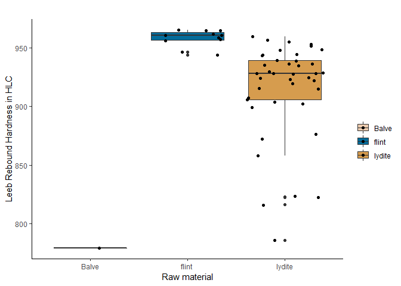

Equotip hardness measurements - Tool function experiment
================
Lisa Schunk
2020-09-10

  - [Goal of the script](#goal-of-the-script)
  - [Load packages](#load-packages)
  - [Get name, path and information of the
    file](#get-name-path-and-information-of-the-file)
  - [Read in original xlsx-file](#read-in-original-xlsx-file)
      - [4. Data analsysis - stats](#data-analsysis---stats)
  - [Data analsysis - plot](#data-analsysis---plot)
  - [Save data](#save-data)
      - [Define output file name](#define-output-file-name)
  - [Show plot files information](#show-plot-files-information)
  - [sessionInfo() and RStudio
    version](#sessioninfo-and-rstudio-version)

-----

# Goal of the script

This script reads the xlsx file (measurements have been generated with
the Equotip Leeb C rebound) and formats the data for a statistical
analysis.  
The script will:

1.  Reads in the original xlsx file and organises the data
2.  Plots the data
3.  Write an XLSX-file and save an R object ready for further analysis
    in R

<!-- end list -->

``` r
dir_in <- "analysis/raw_data_TFE/"
dir_out <- "analysis/plots"
```

Raw data must be located in \~/analysis/raw\_data\_TFE/.  
Formatted data will be saved in \~/analysis/plots. The knit directory
for this script is the project directory.

-----

# Load packages

``` r
library(openxlsx)
library(tools)
library(readr)
library(ggplot2)
library(readxl)
library(tidyverse)
library(wesanderson)
```

-----

# Get name, path and information of the file

``` r
data_file <- list.files(dir_in, pattern = "\\.xlsx$", full.names = TRUE)
md5_in <- md5sum(data_file)
info_in <- data.frame(files = basename(names(md5_in)), checksum = md5_in, 
                      row.names = NULL)
```

The checksum (MD5 hashes) of the imported files are:

``` 
              files                         checksum
1 TFE_hardness.xlsx 199e187160b2666842dcdfb6d26ee75a
```

# Read in original xlsx-file

``` r
imp_data <- read.xlsx(xlsxFile = data_file, sheet = 1, startRow = 3, colNames = TRUE, 
                      rowNames = FALSE, skipEmptyRows = FALSE) 

# changes the mode of 'hardness in HLC from character to numeric 
imp_data$hardness.in.HLC <- as.numeric(imp_data$hardness.in.HLC)
str(imp_data)
```

    'data.frame':   53 obs. of  3 variables:
     $ raw.material   : chr  "flint " "flint " "flint " "flint " ...
     $ ID             : chr  "F1-1" "F1-2" "F1-3" "F1-4" ...
     $ hardness.in.HLC: num  962 957 947 944 965 ...

``` r
flint <- imp_data[1:11,]
lydite <- imp_data[15:52,]
balve <- imp_data[53,]
```

#### 4\. Data analsysis - stats

``` r
# descriptive statistics 
# flint
length(flint[["ID"]])
```

    [1] 11

``` r
summary(flint[["hardness.in.HLC"]])
```

``` 
   Min. 1st Qu.  Median    Mean 3rd Qu.    Max. 
  944.1   956.7   960.8   958.3   963.2   965.4 
```

``` r
# schist
length(lydite[["ID"]])
```

    [1] 38

``` r
summary(lydite[["hardness.in.HLC"]])
```

``` 
   Min. 1st Qu.  Median    Mean 3rd Qu.    Max. 
  785.9   909.4   928.4   916.4   942.5   959.6 
```

``` r
# balve (MU-278)
length(balve[["ID"]])
```

    [1] 1

``` r
summary(balve[["hardness.in.HLC"]])
```

``` 
   Min. 1st Qu.  Median    Mean 3rd Qu.    Max. 
    779     779     779     779     779     779 
```

# Data analsysis - plot

``` r
# boxplot
data_plot <- ggplot (imp_data, aes(y = hardness.in.HLC, x = raw.material, 
                                   fill = raw.material)) + 
  theme_classic() + 
  theme(legend.title = element_blank()) +
  geom_boxplot() + 
  scale_fill_manual(values=wes_palette(n =3,name = "Darjeeling2")) +
  geom_jitter() + labs(x="Raw material", y="Leeb Rebound Hardness in HLC", title="") 

print(data_plot)
```

<!-- -->

# Save data

## Define output file name

``` r
file_out <- paste0(file_path_sans_ext(info_in[["file"]]), "_TFE_plot", ".pdf")
ggsave(filename = file_out, plot = data_plot, path = dir_out, device = "pdf")
```

The files will be saved as “\~/analysis/plots.\[ext\]”.

-----

# Show plot files information

``` r
info_out <- list.files(path = dir_out, pattern = "\\.pdf$", 
                       full.names = TRUE) %>% 
            md5sum()
```

The checksum (MD5 hashes) of the exported files are:

``` 
       analysis/plots/_IE_plot.pdf       analysis/plots/_TFE_plot.pdf 
"b55093e7922a9f0e3f5fb1dfb87e15cb" "d6992a2c2fb56f7c80b03ee2e543f36f" 
```

-----

# sessionInfo() and RStudio version

``` r
sessionInfo()
```

``` 
R version 4.0.2 (2020-06-22)
Platform: x86_64-w64-mingw32/x64 (64-bit)
Running under: Windows 10 x64 (build 18362)

Matrix products: default

locale:
[1] LC_COLLATE=German_Germany.1252  LC_CTYPE=German_Germany.1252   
[3] LC_MONETARY=German_Germany.1252 LC_NUMERIC=C                   
[5] LC_TIME=German_Germany.1252    

attached base packages:
[1] tools     stats     graphics  grDevices utils     datasets  methods  
[8] base     

other attached packages:
 [1] wesanderson_0.3.6 forcats_0.5.0     stringr_1.4.0     dplyr_1.0.2      
 [5] purrr_0.3.4       tidyr_1.1.2       tibble_3.0.3      tidyverse_1.3.0  
 [9] readxl_1.3.1      ggplot2_3.3.2     readr_1.3.1       openxlsx_4.1.5   

loaded via a namespace (and not attached):
 [1] tidyselect_1.1.0 xfun_0.16        haven_2.3.1      colorspace_1.4-1
 [5] vctrs_0.3.4      generics_0.0.2   htmltools_0.5.0  yaml_2.2.1      
 [9] blob_1.2.1       rlang_0.4.7      pillar_1.4.6     glue_1.4.2      
[13] withr_2.2.0      DBI_1.1.0        dbplyr_1.4.4     modelr_0.1.8    
[17] lifecycle_0.2.0  munsell_0.5.0    gtable_0.3.0     cellranger_1.1.0
[21] rvest_0.3.6      zip_2.1.1        evaluate_0.14    labeling_0.3    
[25] knitr_1.29       fansi_0.4.1      broom_0.7.0      Rcpp_1.0.5      
[29] scales_1.1.1     backports_1.1.9  jsonlite_1.7.1   farver_2.0.3    
[33] fs_1.5.0         hms_0.5.3        digest_0.6.25    stringi_1.5.3   
[37] grid_4.0.2       rprojroot_1.3-2  cli_2.0.2        magrittr_1.5    
[41] crayon_1.3.4     pkgconfig_2.0.3  ellipsis_0.3.1   xml2_1.3.2      
[45] reprex_0.3.0     lubridate_1.7.9  assertthat_0.2.1 rmarkdown_2.3   
[49] httr_1.4.2       rstudioapi_0.11  R6_2.4.1         compiler_4.0.2  
```

-----

RStudio version 1.3.1073.

-----

END OF SCRIPT
